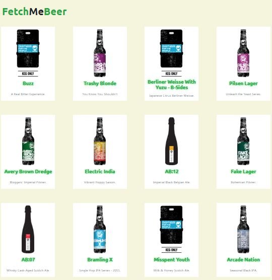
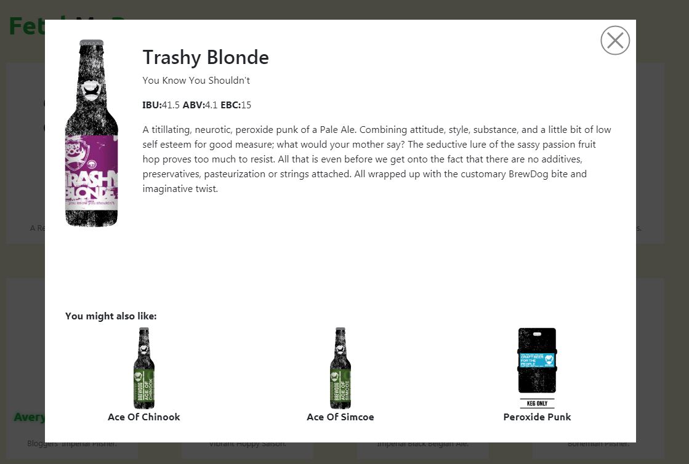

# FetchMeBeer
> React application with use of external API

## Installation
> * yarn install
> * yarn start

## Used technologies
> 

## Features
> * Beers list with infinite scroll (fetching 20 beers at a time)
> * Details view as a modal routing to specific url (e.g. /details/23 - 23 is beer ID)
> * Pending states filled with "loading state"
> * Finding and displaying 3 similar beers based on 3 different beer properties at once:
>     * ABV
>     * IBU
>     * EBC
> * Basic components and unit functions test coverage

## Upcoming features
> * Development version
> * Minor bugfixes

## Preview

